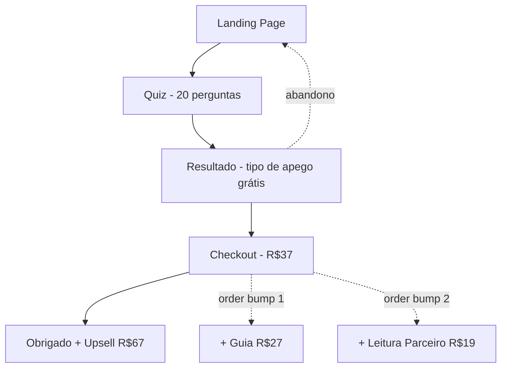
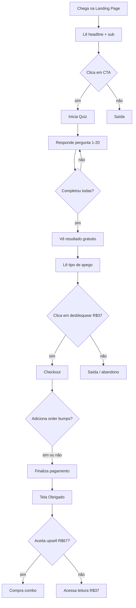

# meujeitodeamar.com.br — UI/UX Specification

**Versão:** 1.0
**Data:** 2026-03-26
**Autora:** Uma (ux-design-expert)
**Status:** Draft — aguardando revisão

---

## Change Log

| Data | Versão | Descrição | Autor |
|------|--------|-----------|-------|
| 2026-03-26 | 1.0 | Documento inicial gerado dos wireframes aprovados | Uma |

---

## 1. Introdução

Este documento define os objetivos de experiência do usuário, arquitetura de informação, fluxos, especificações visuais e estratégia de responsividade para **meujeitodeamar.com.br**. Serve como fundação para o desenvolvimento frontend, garantindo uma experiência coesa, emocional e orientada à conversão.

O produto é um **funil de quiz** baseado em estilos de apego (attachment theory). O usuário responde 20 perguntas, recebe o seu tipo de apego gratuitamente e, em seguida, é convidado a desbloquear a leitura completa por R$37.

---

## 2. UX Goals & Princípios

### 2.1 Personas

**Persona principal — A Buscadora**
Mulher, 25-42 anos, em relacionamento atual ou recentemente terminado. Sente padrões que se repetem nos relacionamentos e busca autoconhecimento. Consome conteúdo de psicologia, espiritualidade e desenvolvimento pessoal. Chega pelo TikTok ou Instagram, sempre em mobile, com atenção fragmentada.

**Persona secundária — A Curiosa**
Entra pelo quiz por diversão ou indicação de alguém. Sem intenção de compra imediata. Pode converter se o resultado emocionar o suficiente. Exige que a copy do resultado funcione para estados emocionais muito diferentes.

---

### 2.2 Objetivos de Usabilidade

| Objetivo | Meta |
|----------|------|
| Conclusão do quiz | Usuário completa as 20 perguntas sem abandono |
| Conversão resultado | Paywall de R$37 gera desejo, não resistência |
| Checkout sem atrito | Preenchimento rápido, alta confiança visual |
| Upsell natural | Oferta de R$67 parece extensão lógica, não pressão |
| Acessibilidade emocional | A interface cria sentimento de cuidado, não urgência |

---

### 2.3 Princípios de Design

1. **Emocional antes de racional** — a interface cria sentimento antes de apresentar lógica
2. **Clareza de estado** — o usuário sempre sabe onde está no funil (barra de progresso, breadcrumb visual)
3. **Mobile-first** — toda decisão de layout parte do mobile; desktop é expansão generosa
4. **Confiança pelo cuidado** — espaçamentos generosos, tipografia serifa, sem urgência artificial
5. **Um CTA por tela** — nunca competir atenção com múltiplas ações primárias

---

## 3. Arquitetura de Informação

### 3.1 Mapa de Telas

### 3.2 Estrutura de Navegação

**Navegação primária:** Não há. O funil é linear e sem menu — o usuário avança sempre para frente.

**Navegação secundária:** Barra de progresso no Quiz (percentual + "X de 20"). Breadcrumb implícito via header estático nas telas de Checkout e Obrigado.

**Estratégia de breadcrumb:** Nenhum breadcrumb explícito. A sensação de progresso vem da barra de progresso no quiz e da mudança de contexto entre telas. Intencionalmente sem "voltar" para evitar abandono.

**Footer:** Apenas links legais (Termos de Uso, Política de Privacidade) — sem navegação de retorno ao funil.

---

## 4. Fluxos de Usuário

### 4.1 Fluxo Principal — Quiz para Compra

**Objetivo do usuário:** Descobrir seu estilo de apego e entender seus padrões de relacionamento.

**Pontos de entrada:** TikTok Ads, Spark Ads, link na bio, indicação orgânica.

**Critério de sucesso:** Usuário completa o checkout e acessa a leitura completa.

**Edge cases e tratamento de erros:**
- Usuário recarrega a página no meio do quiz → idealmente manter estado via localStorage
- Pagamento recusado → mensagem clara sem punição emocional, opção de tentar outro cartão
- Usuário volta ao resultado depois de sair sem comprar → resultado ainda visível, CTA de compra ativo

---

### 4.2 Fluxo Secundário — Upsell

**Objetivo:** Converter comprador de R$37 em comprador de R$67 (combo 4 leituras).

**Pontos de entrada:** Tela de Obrigado, imediatamente após confirmação de compra.

**Critério de sucesso:** Usuário aceita a oferta na mesma sessão (1-click idealmente).

**Edge cases:**
- Usuário ignora e fecha → sem perda; acesso à leitura R$37 garantido
- Upsell aceito → confirmação clara de que o upgrade foi processado

---

## 5. Wireframes & Mockups

### 5.1 Arquivos de Design

**Arquivo principal:** `docs/design/wireframes.html` — 5 telas completas (mobile + desktop toggle)
**Design system:** `docs/design/design-system.html` — paleta, tipografia, tokens, componentes

Ambos os arquivos são HTMLs estáticos navegáveis via browser. Representam a fonte de verdade visual para o desenvolvimento.

---

### 5.2 Telas Principais

#### Landing Page

**Propósito:** Capturar atenção e levar ao quiz com um único CTA.

**Elementos principais:**
- Hero: headline emocional + sub-headline de credibilidade + CTA primário
- "Simples assim:": 3 steps (responda, descubra, entenda) — texto simples, sem ícones decorativos
- CTA secundário de reforço
- Footer com links legais apenas

**Notas de interação:** Sem scroll horizontal. CTA é o único elemento interativo relevante. Sem popups, sem chat, sem contagem regressiva.

**Referência:** `docs/design/wireframes.html` → tela "Landing"

---

#### Quiz

**Propósito:** Coleta das 20 respostas com alta taxa de conclusão.

**Elementos principais:**
- Header estático: nome do site (sem logo) + barra de progresso (%)
- Número da pergunta: "X de 20"
- Enunciado da pergunta
- 4-5 opções de resposta (cards ou radio estilizado)
- Navegação: avanço automático ao selecionar (sem botão "próxima" onde possível)

**Notas de interação:** Progresso visual (barra + texto) é crítico para reduzir abandono. Animação de transição entre perguntas reforça sensação de avanço.

**Referência:** `docs/design/wireframes.html` → tela "Quiz"

---

#### Resultado

**Propósito:** Entregar valor emocional gratuito e criar desejo pelo produto pago.

**Elementos principais:**
- "Seu jeito de amar é [tipo]" — título com cor da tipologia (Rose Smoke family)
- Descrição curta do tipo de apego (conteúdo gratuito)
- Bloco de transição: validação emocional + curiosidade + oferta
- Badge "🔒 Bloqueado" + lista dos tópicos da leitura completa
- CTA: "Desbloqueie sua leitura completa" + preço "Apenas R$37"
- Social proof e garantia

**Notas de interação:** Mobile: layout de coluna única, CTA centralizado e fixo ou ao final do conteúdo. Desktop: coluna única centralizada (max-width 680px), sem painel lateral — o usuário lê antes de ver a oferta.

**Referência:** `docs/design/wireframes.html` → tela "Resultado"

---

#### Checkout

**Propósito:** Processar pagamento com mínimo de atrito e máxima confiança.

**Elementos principais (ordem no mobile):**
1. Resumo do pedido ("Sua leitura completa — R$37")
2. Formulário de pagamento (nome, email, cartão)
3. Order bumps (Guia R$27 + Leitura do Parceiro R$19) — entre form e botão submit
4. Botão "Finalizar" + selos de segurança

**Notas de interação:** Sem distrações. Campos com label clara. Validação inline (não só no submit). Order bumps são checkboxes estilizados — opt-in, não opt-out.

**Referência:** `docs/design/wireframes.html` → tela "Checkout"

---

#### Obrigado + Upsell

**Propósito:** Confirmar compra e apresentar upsell em momento de máxima receptividade.

**Elementos principais:**
- Confirmação: "Agora você conhece o seu jeito de amar."
- Transição para upsell: "E as pessoas ao seu redor?"
- Oferta combo: 4 leituras por R$67 (em vez de R$148)
- Caixa de preço com contraste claro
- CTA de aceitar + link de recusar sem julgamento

**Notas de interação:** Desktop: coluna única centralizada (max-width 640px), sem layout em grid. Mobile: mesmo conteúdo em stack vertical.

**Referência:** `docs/design/wireframes.html` → tela "Obrigado"

---

## 6. Component Library / Design System

### 6.1 Abordagem

Custom design system greenfield, sem dependência de library externa (sem Bootstrap, sem Material). Tokens definidos como CSS custom properties. Componentes atômicos construídos do zero.

**Referência completa:** `docs/design/design-system.html`

---

### 6.2 Componentes Principais

#### Button (CTA Primary)

**Propósito:** Ação principal de conversão em cada tela.

**Variantes:**
- `primary` — fundo Burgundy `#4B1D3F`, texto Off-White, border-radius 100px
- `ghost` — apenas texto, sem fundo (ex: "Não, obrigada" no upsell)

**Estados:** default, hover (brighten 10%), active (scale 0.98), disabled (opacity 0.4), loading (spinner inline)

**Uso:** Máximo 1 CTA primary por tela. Largura: 100% no mobile, auto no desktop com max-width.

---

#### Progress Bar (Quiz)

**Propósito:** Indicar avanço no quiz para reduzir abandono.

**Variantes:** única — fundo `--subtle`, fill `--dark` (Burgundy), transição CSS suave (300ms ease)

**Estados:** 0% (início) → 100% (última pergunta). Acompanhado de texto "X de 20".

---

#### Card de Resposta (Quiz)

**Propósito:** Opção de resposta selecionável.

**Variantes:** unselected, selected (borda Burgundy + fundo Rose Smoke leve), hover

**Estados:** idle, hover, selected, disabled (após selecionar outra)

---

#### Badge Bloqueado

**Propósito:** Indicar conteúdo pago que o resultado gratuito não entrega.

**Variantes:** única — `🔒 Bloqueado` com `white-space: nowrap; flex-shrink: 0`

**Estados:** estático (sem interação)

---

#### Order Bump Card (Checkout)

**Propósito:** Apresentar produto adicional no checkout como opt-in.

**Variantes:** unchecked, checked (destaque com borda Burgundy)

**Estados:** idle, checked

---

#### Input de Formulário

**Propósito:** Coleta de dados de pagamento.

**Variantes:** text, email, card number, CVV, expiry

**Estados:** idle, focused (borda Burgundy), filled, error (borda vermelho suave + mensagem inline), disabled

---

## 7. Branding & Style Guide

### 7.1 Paleta de Cores

| Tipo | Hex | Token CSS | Uso |
|------|-----|-----------|-----|
| Base | `#E8D9C1` | `--bg` | Background de todas as telas |
| Tipologias | `#D8A7B1` | `--sand` | Cor de destaque para tipos de apego |
| Ação/Dark | `#4B1D3F` | `--cta`, `--dark` | Botões, progress bar, destaques |
| Texto | `#1B1B11` | `--text` | Corpo de texto, títulos |
| Warm bg | `#DFD0B7` | `--bg-warm` | Fundo alternativo, hover states |
| Muted | `#A89080` | `--muted` | Textos secundários, placeholders |
| Subtle | `#D4C5AE` | `--subtle` | Bordas, dividers, bg de progresso |
| Off-white | `#F5EEE4` | `--white` | Texto sobre fundo escuro |
| Canvas | `#2A1A20` | (body bg) | Frame externo em desktop |

**Tipologias (Rose Smoke family):**
| Tipo | Hex | Token |
|------|-----|-------|
| Ansioso | `#D8A7B1` | `--ansioso` |
| Distante | `#C4909C` | `--distante` |
| Seguro | `#BF8A96` | `--seguro` |
| Confuso | `#D4B5B0` | `--confuso` |

---

### 7.2 Tipografia

**Fontes:**
- **Primária (display):** Cormorant Garamond — titles, headlines, nome do tipo de apego
- **Secundária (body):** Jost — corpo de texto, CTAs, labels, formulários
- **Monospace:** não utilizado

**Escala tipográfica:**

| Elemento | Tamanho | Peso | Line Height |
|----------|---------|------|-------------|
| H1 (headline hero) | 32px / 48px desktop | 300–400 | 1.1 |
| H2 (título de seção) | 24px / 36px desktop | 400 | 1.2 |
| H3 (subtítulo) | 20px / 28px desktop | 400 | 1.3 |
| Body | 16px | 400 | 1.6 |
| Small / caption | 13px | 400 | 1.5 |
| CTA button | 16px | 500 | 1 |
| Badge / label | 13px | 600 | 1 |

---

### 7.3 Iconografia

**Biblioteca:** Nenhuma. Uso restrito a emojis Unicode funcionais (ex: `🔒` para conteúdo bloqueado). Sem icon library externa para manter leveza.

**Diretrizes:** Ícones/emojis apenas quando funcionais (comunicam estado). Nunca decorativos.

---

### 7.4 Espaçamento & Layout

**Sistema de grid:**
- Mobile: coluna única, padding horizontal 24px
- Desktop: max-width 680px centrado (conteúdo), max-width 800px (checkout com painel)
- Canvas desktop: body background `#2A1A20`, conteúdo em card centralizado

**Escala de espaçamento (base 8px):**
`4 / 8 / 12 / 16 / 24 / 32 / 48 / 64px`

**Border radius:**
- Botões: `100px` (pill)
- Cards: `12px`
- Inputs: `8px`
- Badges: `100px`

---

## 8. Acessibilidade

### 8.1 Padrão Alvo

**WCAG 2.1 Nível AA** — mínimo para lançamento.

---

### 8.2 Requisitos

**Visual:**
- Contraste de cor: mínimo 4.5:1 para texto normal, 3:1 para texto grande (verificar Off Black `#1B1B11` sobre Nude `#E8D9C1` — passa AA)
- Indicadores de foco: outline visível em todos os elementos interativos (`:focus-visible`)
- Texto redimensionável: layout não quebra até 200% zoom

**Interação:**
- Navegação por teclado: Tab order lógico em todos os formulários e quiz
- Suporte a screen reader: labels em todos os inputs, `aria-label` nos cards de resposta, `aria-live` na barra de progresso do quiz
- Touch targets: mínimo 44x44px para todos os elementos tocáveis (botões, cards de resposta, order bumps)

**Conteúdo:**
- Alt text: todas as imagens decorativas com `alt=""`, funcionais com descrição
- Estrutura de headings: hierarquia H1 > H2 > H3 respeitada por tela
- Labels de formulário: todos os inputs com `<label>` associado, nunca só placeholder

---

### 8.3 Estratégia de Testes

- Verificação manual com VoiceOver (iOS) antes do lançamento
- Teste de contraste com ferramenta (ex: Colour Contrast Analyser) para todas as combinações de cor texto/fundo
- Teste de navegação por teclado em desktop Chrome

---

## 9. Estratégia de Responsividade

### 9.1 Breakpoints

| Breakpoint | Min Width | Max Width | Dispositivos |
|------------|-----------|-----------|--------------|
| Mobile | 0px | 767px | iPhone, Android, todos os smartphones |
| Tablet | 768px | 1023px | iPad, tablets Android |
| Desktop | 1024px | 1439px | Notebooks, monitores |
| Wide | 1440px | — | Monitores grandes |

**Estratégia geral:** O produto é primariamente mobile (tráfego de redes sociais). O layout desktop é uma expansão do mobile, nunca uma recriação.

---

### 9.2 Padrões de Adaptação

**Mudanças de layout:**
- Mobile: coluna única, stack vertical
- Desktop: conteúdo centralizado com max-width, mais espaço em branco lateral
- Checkout desktop: possível layout 2 colunas (form | resumo do pedido) — a confirmar

**Mudanças de navegação:** Nenhuma — sem menu em nenhum breakpoint.

**Prioridade de conteúdo:** Mesmo conteúdo em todos os breakpoints. Nenhum elemento oculto por breakpoint exceto ajustes cosméticos de espaçamento.

**Mudanças de interação:**
- Mobile: tap targets maiores, sem hover states
- Desktop: hover states nos cards de resposta e botões, cursor pointer

---

## 10. Animações & Micro-interações

### 10.1 Princípios de Motion

- **Propósito:** toda animação comunica progresso ou resposta — nunca é decorativa
- **Duração:** 150-300ms para feedback imediato, 400-600ms para transições de tela
- **Easing:** `ease-out` para entradas, `ease-in` para saídas, `ease-in-out` para loops
- **Acessibilidade:** respeitar `prefers-reduced-motion` — desabilitar todas as animações se ativo

---

### 10.2 Animações Principais

- **Progresso do quiz:** barra de progresso animada ao avançar (Duration: 300ms, Easing: ease-out)
- **Seleção de resposta:** card selecionado com transição de cor/borda (Duration: 150ms, Easing: ease-out)
- **Transição entre perguntas:** slide horizontal sutil ou fade (Duration: 250ms, Easing: ease-in-out)
- **Aparição do resultado:** fade-in do tipo de apego com leve scale (Duration: 500ms, Easing: ease-out)
- **CTA hover:** brightening suave do background do botão (Duration: 200ms, Easing: ease)
- **Order bump check:** transição de estilo do card ao marcar (Duration: 200ms, Easing: ease-out)

---

## 11. Performance

### 11.1 Metas de Performance

- **Page Load (LCP):** abaixo de 2.5s em conexão 4G
- **Interaction Response (INP):** abaixo de 200ms para todas as interações do quiz
- **Animation:** 60fps em todas as animações (sem jank)
- **Total Bundle:** abaixo de 200kb JS gzipped

---

### 11.2 Estratégias de Design

- Fontes via Google Fonts com `display=swap` para evitar FOIT
- Imagens: apenas se absolutamente necessárias, com lazy loading
- Sem carregamento de scripts de terceiros no critical path
- CSS mínimo — design token-driven, sem override chains
- O quiz armazena estado em localStorage para tolerar recarregamento de página

---

## 12. Próximos Passos

### 12.1 Ações Imediatas

1. Revisão e aprovação deste documento por David
2. Decisão DP-01: Kiwify vs Hotmart (impacta integração de checkout — Epic 3)
3. Definir copy das 20 perguntas do quiz (conteúdo não está nos wireframes)
4. Confirmar copy das 4 tipologias (texto da leitura completa bloqueada)
5. Criar stories de desenvolvimento com @sm baseadas neste spec

---

### 12.2 Design Handoff Checklist

- [x] Todos os fluxos de usuário documentados
- [x] Inventário de componentes completo
- [x] Requisitos de acessibilidade definidos
- [x] Estratégia responsiva clara
- [x] Brand guidelines incorporadas
- [x] Metas de performance estabelecidas

---

### 12.3 Decisões em Aberto

| ID | Decisão | Impacto | Status |
|----|---------|---------|--------|
| DP-01 | Kiwify vs Hotmart | Integração de checkout (Epic 3) | Pendente |
| DP-02 | Persistência do quiz | localStorage vs backend | Pendente |
| DP-03 | Copy das 20 perguntas | Conteúdo do quiz | Pendente |
| DP-04 | Copy das 4 leituras completas | Produto digital entregue | Pendente |

---

*Gerado por Uma (ux-design-expert) em 2026-03-26*
*Artefatos de referência: `docs/design/wireframes.html`, `docs/design/design-system.html`*
